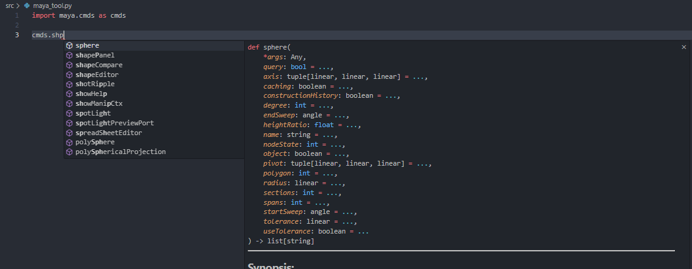
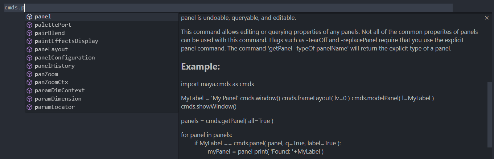

# Autodesk-Maya-Python-IntelliSense

Please get the latest version from [Releases](https://github.com/RyotaUnzai/Autodesk-Maya-Python-IntelliSense/releases), and See README after unzipping.

---

Autodesk Maya Python IntelliSense is a stub file for static type checking in Python when developing Maya commands.

## What can be done by introducing

|                        |     | 
| ---------------------- | --- | 
| Argument and return type hints |  | 
| Synopsis of command |  | 
| hyperlink |  | 

## What is required for introduction
To use it, you need to load the stub file and configure mypy in your IDE. Please make the necessary settings when installing. This repository is a good reference for setting up VSCode.

### Supported Languages
English

### Supported Version
Maya 2023
Maya 2024

## How to build stub files
If you want to build it yourself, clone this repository.
1. Click on setup.bat
2. Open Autodesk-Maya-Python-IntelliSense in VSCode with `File > Open Folder...` Open Autodesk-Maya-Python-IntelliSense in
3. Execute create_pyi.py
    
| argument  | Description | Default values | 
| --- | --- | --- | 
| version | Specify Maya version such as 2023, 2024.2 | 2024 | 
| export_path | Define the folder destination you want to output to | ${workspaceFolder}\\maya2024 | 
| document_dir | Specify the document directory to be referenced.You need to download the document from the [official page](https://www.autodesk.com/support/technical/article/caas/tsarticles/ts/6hGHDwrHzKBq8zd65p4LpK.html). Please download and deploy the corresponding documentation, including minor versions. Maya Creative is not supported. | ${workspaceFolder}\\mayaProductHelps|

